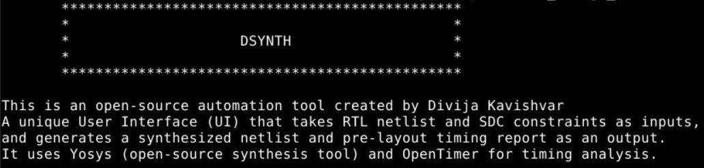
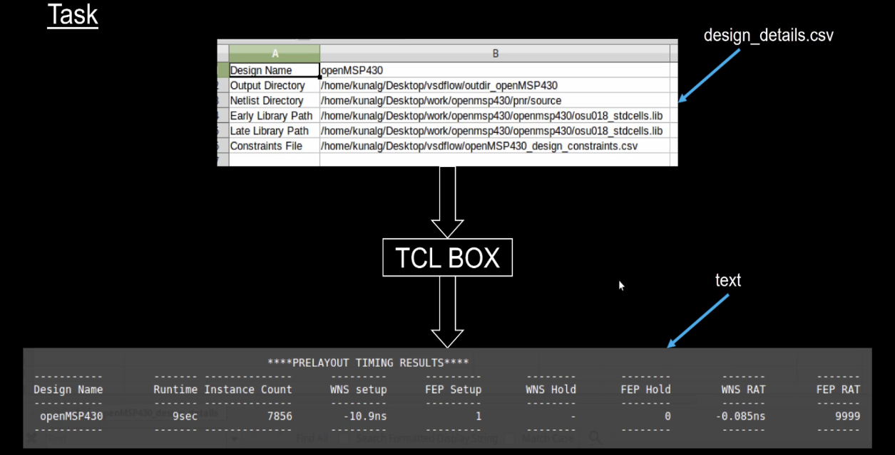
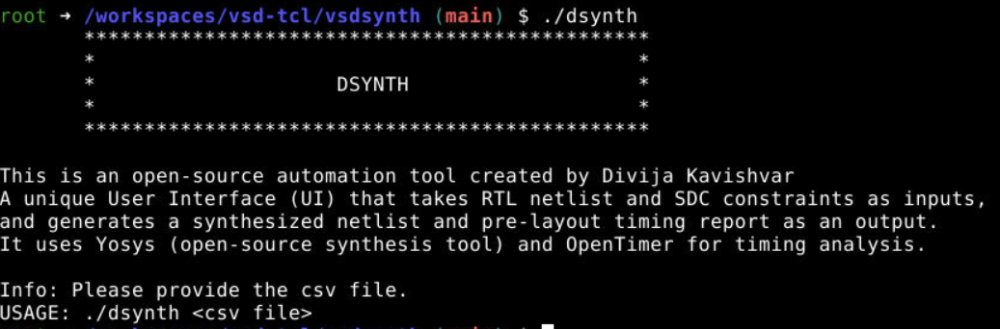
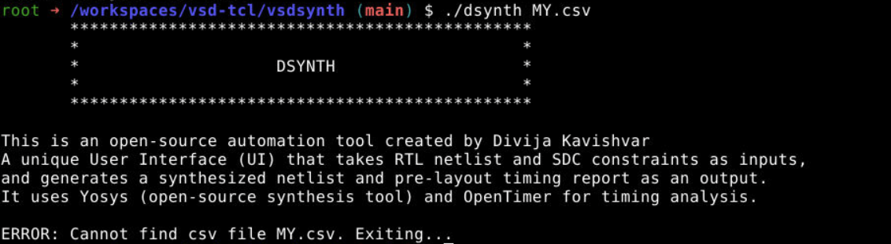
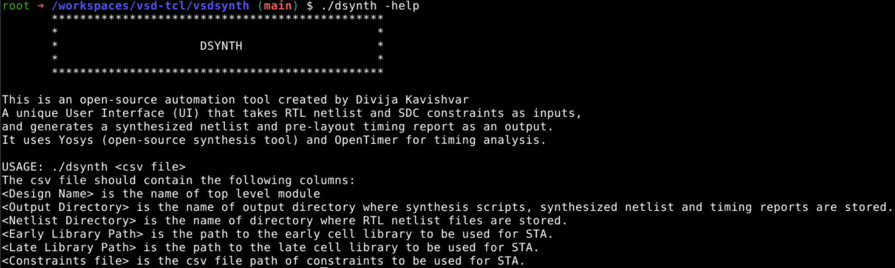

# TCL_Workshop

> Engaged in a 5-day VSD training workshop focused on EDA automation using TCL scripting. Developed a TCL-based automation workflow that takes design information through CSV-formatted inputs, automates RTL synthesis using Yosys and Static Timing Analysis using OpenTimer, and generates a consolidated design report. The designed TCL Box automation interface is named **`DSYNTH`**.

---

## Day 1: Creating a TCL Command and Passing CSV from UNIX Shell

## Objective

The objective of Day 1 is to understand how a TCL-based automation flow can process design data from a CSV input, synthesize it using **Yosys**, and perform **Static Timing Analysis (STA)** using **OpenTimer**, all wrapped inside the **DSYNTH Toolbox**.

---

## TCL Box Overview

The designed TCL Box acts as a single command-line interface that:
- Accepts design inputs in CSV format
- Automates RTL synthesis using **Yosys**
- Automates static timing analysis using **OpenTimer**
- Generates a structured and consolidated design report

---

## Subtasks and Tools Used

The following subtasks need to be implemented:
- Create a UNIX shell command (`dynth`) and pass `.csv` input to a TCL script
- Convert CSV inputs to **Format[1] and SDC** for synthesis
- Convert **Format[1] and SDC** to **Format[2]** for timing analysis
- Invoke Yosys and OpenTimer through TCL automation
- Generate output reports

---

`$argv[1]` acts as an argument placeholder through which the **design details CSV file** is passed from the UNIX shell to the TCL script. This enables the TCL automation flow to dynamically read user-provided design inputs. Three main user interaction scenarios were explored and handled as part of the Day 1 implementation.

---

### Scenario 1: No CSV File Provided

In this scenario, the user executes the command without providing a CSV file as input.  
The toolbox detects the missing argument and prompts the user with an appropriate error message indicating that the design input file is required.

---

### Scenario 2: Incorrect CSV File Provided

In this case, the user provides the name of a CSV file that does not exist in the specified path.  
The shell/TCL validation logic checks for file existence and reports an error, preventing further execution of the synthesis and timing flow.

---

### Scenario 3: Help Option (`--help`)

When the user invokes the tool using the `--help` option, the toolbox displays guidance related to:

- Expected CSV file structure  
- Required design input fields  
- Command usage and execution flow  

This helps users correctly format the CSV file and understand how to run the automation tool.

---

## Files Created

Two files were created as part of Day 1:

- **`dynth`** – Shell script responsible for user input handling and validation  
- **`dynth.tcl`** – TCL script implementing the automation flow

